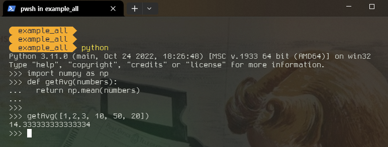
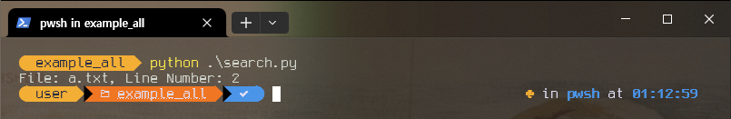

# console에서 python
> console에서 python을 실행하는 방법을 연습한다. 

목적:
  1. terminal과 친숙해지기
  2. python과 친숙해지기

#programing의_근본은_console

~~~python

,---,---,---,---,---,---,---,---,---,---,---,---,---,-------,
| ~ | 1 | 2 | 3 | 4 | 5 | 6 | 7 | 8 | 9 | 0 | [ | ] | <-    |
|---'-,-'-,-'-,-'-,-'-,-'-,-'-,-'-,-'-,-'-,-'-,-'-,-'-,-----|
| ->| | " | , | . | P | Y | F | G | C | R | L | / | = |  \  |
|-----',--',--',--',--',--',--',--',--',--',--',--',--'-----|
| Caps | A | O | E | U | I | D | H | T | N | S | - |  Enter |
|------'-,-'-,-'-,-'-,-'-,-'-,-'-,-'-,-'-,-'-,-'-,-'--------|
|        | ; | Q | J | K | X | B | M | W | V | Z |          |
|------,-',--'--,'---'---'---'---'---'---'-,-'---',--,------|
| ctrl |  | alt |                          | alt  |  | ctrl |
'------'  '-----'--------------------------'------'  '------'
~~~
### 1. python을 실행
- 터미널에서 python을 입력 후, enter 
- python shell이 실행
	- code를 입력하면 적용가능
	- 한 줄 단위 입력
	- copy & paste로 여러 줄 입력 가능

```bash
c:> python
Python 3.11.0 (main, Oct 24 2022, 18:26:48) [MSC v.1933 64 bit (AMD64)] on win32
Type "help", "copyright", "credits" or "license" for more information.
>>
```

종료할 경우, `quit()` 입력 후 enter
### 2. shell에서 간단한 계산 및 coding

- 사칙연산 

```bash
Python 3.11.0 (main, Oct 24 2022, 18:26:48) [MSC v.1933 64 bit (AMD64)] on win32
Type "help", "copyright", "credits" or "license" for more information.
>>> 32 + 16
48
>>>
```

- 변수선언 및 함수실행

```bash

Python 3.11.0 (main, Oct 24 2022, 18:26:48) [MSC v.1933 64 bit (AMD64)] on win32
Type "help", "copyright", "credits" or "license" for more information.
>>> name = "PSW"
>>> print (name)
PSW
>>>

```

- 변수선언 및 조건문 실행

```python

Python 3.11.0 (main, Oct 24 2022, 18:26:48) [MSC v.1933 64 bit (AMD64)] on win32
Type "help", "copyright", "credits" or "license" for more information.
>>> num1 = 1
>>> num2 = 2
>>>
>>> sum = num1 + num2
>>> if sum < 3:
...   print("3보다 적다")
... else:
...   print("3보다 크다")
...
3보다 크다
>>>
```

조건문을 기술할 대는 ... 이후에 들여쓰기 2칸을 반드시 엄수한다. 그리고 그 맥락(Context)이 종료되는 시점에 다시 2칸을 내어쓰기 한다. 맥락이라 함은 "상황"을 의미하며 **프로그래밍 언어에서는 매우 중요한 개념**이다. 

### 3. 함수 정의 

- line 단위로 코딩가능
- def로 함수를 정의할 때는 
	- 2칸(space) 들여쓰기 엄수
	- 함수정의를 끝내려면 아무것도 입력하지 않고 enter
- `어떤 값을 사용하려면 먼저 정의`되어 있어야 함(순차적 정의)

```python
Python 3.11.0 (main, Oct 24 2022, 18:26:48) [MSC v.1933 64 bit (AMD64)] on win32
Type "help", "copyright", "credits" or "license" for more information.
>>> import numpy as np
>>> def getAvg(numbers):
...   return np.mean(numbers)
...
>>>
>>> getAvg([1,2,3, 10, 50, 20])
14.333333333333334
>>>

```


### 4. context(맥락) 보기 
> 프로그래밍에서 Context는 현재 code가 돌아가고 있는 메모리 정보를 뜻한다. 사용할 수 있는 변수, 함수가 정의되어 있으며 코드가 실행되는 동안 값이 변하게 된다. 

```python

# 현재 context의 변수, 함수를 리스트로 보여준다.
print(dir())  

# 현재 전역범위 내의 변수, 함수를 리스트로 보여준다.
print(globals()) 

# 현재 지역범위 내의 변수, 함수를 리스트로 보여준다.
print(locals())

```

### 5. 파일(.py)로 만들어 실행
- python shell을 실행 후, 라인별로 code로 입력하기 불편함
- 현실에서는 .py 파일(소스)로 코드를 작성함
- .py 파일은 여러개로 기능별로 만들어짐
- python [파일명.py]로 소스를 실행함
	- 파일명은 주로 현재경로에 있는 .py 파일

example:
1. 에디터(sublimetext)를 실행한다. 
2. print("hi")를 입력한다. 
3. test.py로 저장한다. 
4. test.py가 저장된 폴더로 이동 후, 터미널을 연다.
5. python test.py를 입력하고 enter를 누른다. 
### 6. 생성 AI를 활용하여 소스 만들기

ChatGPT에서 사용한 prompt:

~~~python
1. 현재의 디렉토리에서 확장자 txt인 것만 검색한다. 
2. 검색된 파일 내용에서 "고양이"가 있는 파일만 검색한다. 
3. 검색된 고양이가 있는 라인번호와 파일명을 출력한다. 
4. 파이썬으로 만들어줘
~~~

생성된 소스:

```python
import os

def search_cat_in_files(directory="."):
    # 현재 디렉토리에서 txt 확장자를 가진 파일 목록을 가져옴
    txt_files = [file for file in os.listdir(directory) if file.endswith(".txt")]

    # txt 확장자를 가진 각 파일에 대해 반복
    for file_name in txt_files:
        with open(os.path.join(directory, file_name), 'r', encoding='utf-8') as file:
            # 파일 내용을 한 줄씩 읽어들임
            for line_number, line in enumerate(file, start=1):
                # "고양이"를 포함하는 라인인지 확인
                if "고양이" in line:
                    # 고양이가 있는 라인 번호와 파일명 출력
                    print(f"File: {file_name}, Line Number: {line_number}")

# 현재 디렉토리에서 "고양이"를 포함한 라인과 파일명을 출력
search_cat_in_files()

```

테스트 방법:
1. 현재의 디렉토리에서 a.txt를 만든다. 
2. 강아지를 입력하고 enter, 고양이를 입력하고 저장한다.
3. 위의 소스를 search.py로 저장한다. 
4. python search.py를 입력하고 enter를 누른다. 


