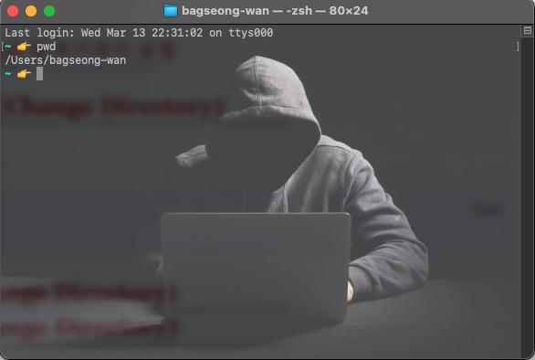
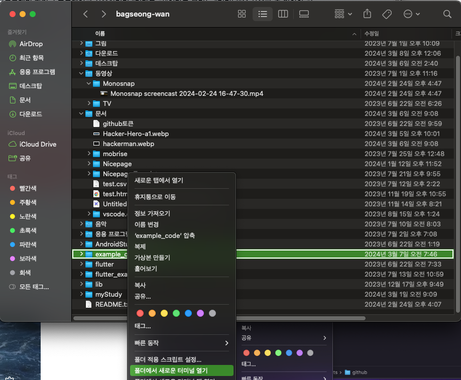
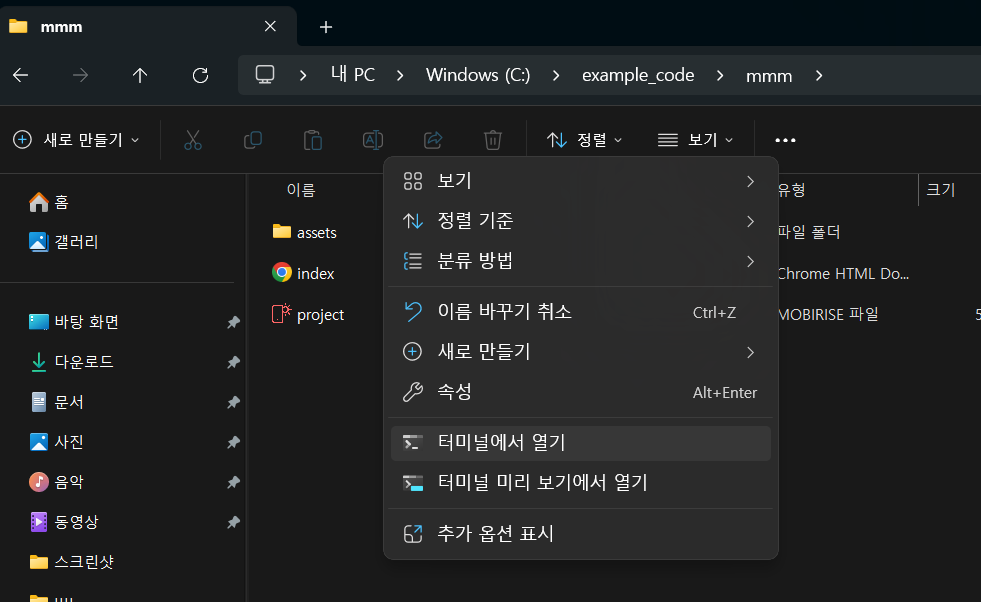
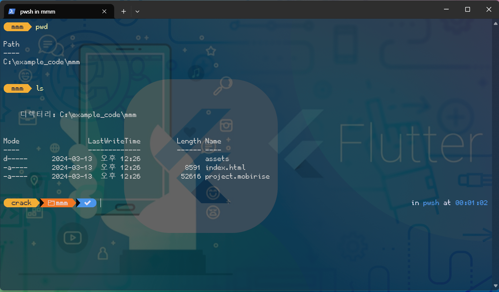
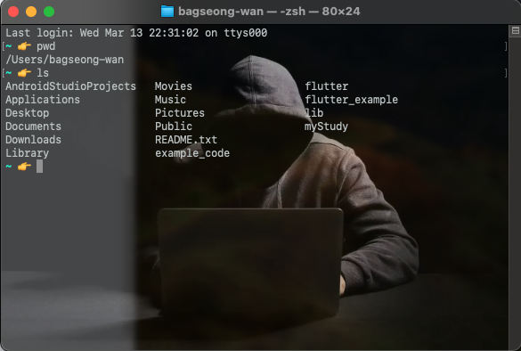

# terminal 생존 매뉴얼

### 목적: 
> git을 **터미널 환경**에서 사용하기 힘들어 하는 사용자를 위한 `터미널 기초사용법`

대부분의 프로그래밍 관련 소프트웨어를 사용하려면 "커맨드 창"이라고 불리는 "터미널"을 사용할 줄 알아야 한다. 터미널은 CUI(Character User Interface)라는 문자열 기반의 사용자 환경을 제공하며 상당히 오래된 방법이지만 모든 운영체제의 기초이기도 하다. 90년대까지만 하더라도 모든 컴퓨터의 기초는 터미널부터 시작이었고 지금까지도 개발환경에서는 `그 상식이 유효하다`. 

이 문서에서는 **Linux, macOS, Windows와 호환이 될 수 있도록 "터미널 기준(윈도우)"으로 기초 명령어**를 다룬다. 

윈도우 **사용자라면 [Store에서 터미널을 설치를 강권](https://apps.microsoft.com/detail/9n0dx20hk701?activetab=pivot%3Aoverviewtab&hl=ko-kr&gl=KR)**한다. 도스 프롬프트보다 강력한 기능을 제공하기 때문이다.  

### 1. 실행 & 현재경로 
> 윈도우에서는 윈도우 키를 누르고 "터미널". macOS에서는 cmd + space를 누르고 "터미널"을 입력하면 실행가능하다. 그러나 특정 폴더(디렉토리)에서부터 빠르게 시작하고자 한다면 Finder나 탐색기의 메뉴를 통해 바로 실행할 수도 있다. 

현재 경로명을 표시하는 명령어는 다음과 같다. 
```bash
pwd
```


#### 1.1 macOS의 Finder에서 실행



1. finder에서 폴더선택
2. 우클릭, 메뉴생성
3. 메뉴에서 `폴더에서 새로운 터미널 열기` 선택

#### 1.2 windows의 탐색기에서 실행




1. 탐색기에서 폴더선택
2. 우클릭, 메뉴생성
3. 메뉴에서 `터미널에서 열기` 선택

### 2. 현재 경로의 파일과 폴더보기(ls)
> **ls** 명령어를 통해 현재 폴더의 하위폴더와 파일들을 볼 수 있다.



가장 빈번하게 사용되는 명령어이다. 

### 3. 경로이동(Change Directory)

> **cd** 명령어를 사용한다. 절대경로를 이용하여 한 번에 이동도 가능하다. 그러나 대부분 현재 폴더를 기준으로 상대위치에 존재하는 폴더명으로 이동한다. 상위폴더로 이동시에는 ".."를 사용하여 이동한다.
> 

1. 상위폴더 이동
```bash
cd ..
```

2. 하위 폴더 이동
```bash
cd 하위폴더명
```

3. 절대폴더 이동
``` bash
cd 절대경로
```


### 4. 삭제
> macOS: rm 파일명[폴더명]
> windows:
>   del 파일명 
>   rmdir 폴더명
> 을 통해서 파일이나 폴더를 삭제할 수 있다. 

만약 폴더에 내부파일이 있다면  다음과 같은 명령어를 수행하여 삭제가 가능하다. 

(macOS)
```bash
rm -rf 폴더명
```

(windows)
```bash
rmdir /s 폴더명
```

### 5. 복사
> cp 원본파일명 타겟파일명 을 통해서 파일을 복사할 수 있다. 

다음은 현재 폴더의 a.txt를 하위 폴더 text에 들어가는 b.txt로 복사하는 예제이다. 
```bash
cp a.txt text/b.txt
```

### 6. 빠르게 git 사용하기
> git은 터미널 창에서 사용할 때가 가장 편하다. 그러므로 대부분의 사용자들은 터미널 환경에서 git을 사용하고 있다. 

다음은 참고사항이다.

- 반드시 `.git이 있는 폴더`에서 git command를 사용해야 한다.
- git add를 통해 작업 디렉토리의 파일을 stage에 올린다. 
	- stage에 올린 파일을 commit 할 경우에만 repository에 저장된다. 
	- commit 하기 전에, add한 파일 정보를 돌리고자 한다면
		- git reset 명령어를 입력한다. 
- git push를 하면 원격 레포지토리(주로 github)에 pc의 레포지토리를 올린다. 
- git pull은 원격 레포지토리에서 정보를 가져와 pc의 레포지토리에 적용한다. 

#### 6.1 PC의 파일을 repository에 적용하고 github에 올리기
> .git이 있는 폴더로 이동한다. 그리고 아래와 같은 커맨드를 입력한다. 

```bash
git add .
git commit -a -m "커밋할 때 기록할 메시지"
git pull
git push
```

위에서 push하기 전에 commit 후, pull 하는 이유는 **merge시 충돌의 빈도수를 줄이기** 위함이다. 

#### 6.2 github의 repository 정보를 pc에 저장하기 
> .git이 있는 폴더로 이동한다. 그리고 아래와 같은 커맨드를 입력한다. 

```bash
git add .
git commit -a -m "커밋할 때 기록할 메시지"
git pull
```

위에서 pull하기 전에 commit하는 이유는 **merge시 충돌의 빈도수를 줄이기** 위함이다. 
#### 6.3 github의 repository와 충돌
종종 github에서 직접 수정하고, pc에서 수정하여 push와 pull에서 충돌이 나는 경우가 발생한다. 
이 때 자신이 git 초보 사용자로 판단된다면 
1. github을 최우선으로 생각한다. 
2. pc의 내용을 삭제한다. 
3. git clone [github 주소.git]을 하며 github의 내용을 pc로 가져온다. 
와 같은 방법을 수행한다. 
